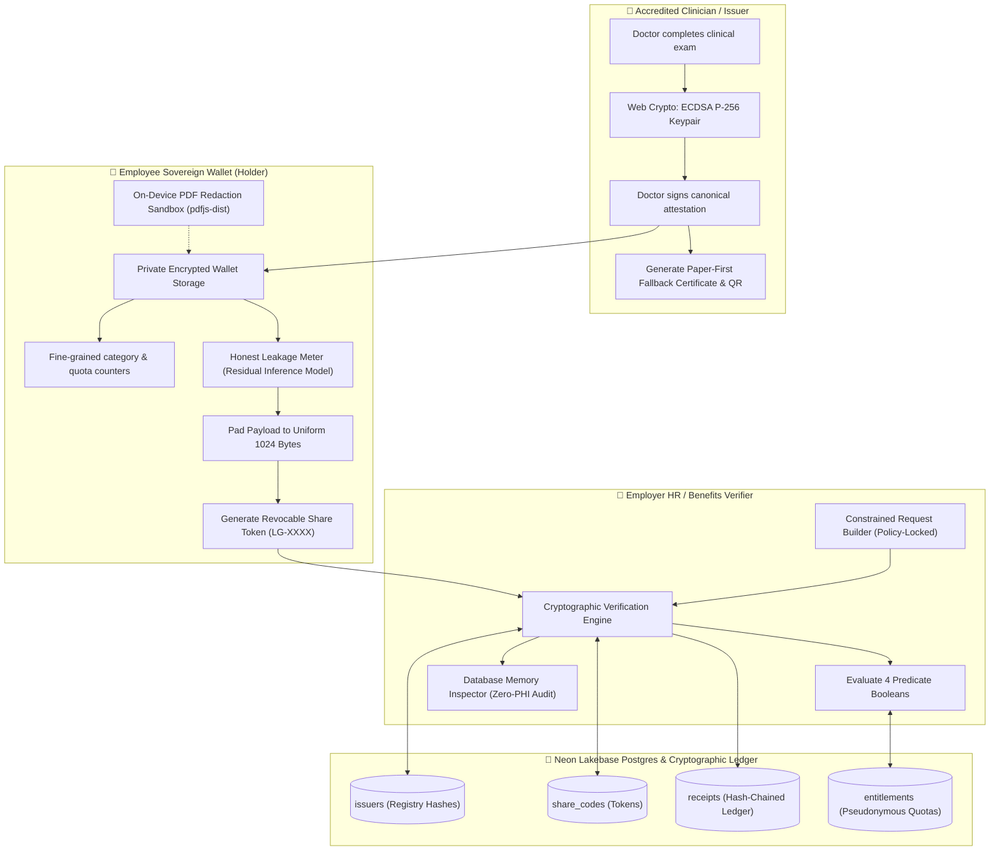
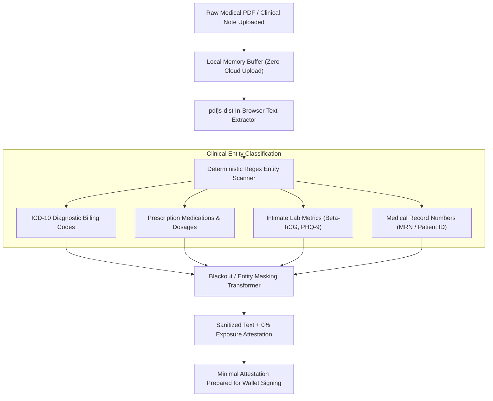
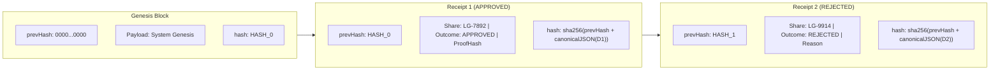
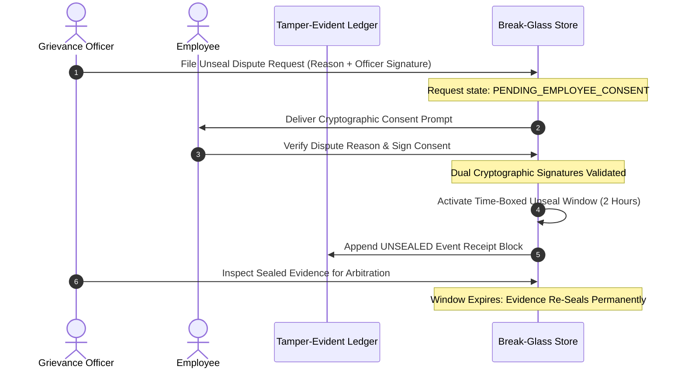

# 🛡️ Vouch — Zero-Knowledge Selective-Disclosure Medical Protocol

[](https://nextjs.org/)
[](https://www.typescriptlang.org/)
[](https://developer.mozilla.org/en-US/docs/Web/API/Web_Crypto_API)
[](https://neon.tech/)
[](https://opensource.org/licenses/MIT)
[](https://github.com/tarunagnihotri534/Vouch)

> **A research-grade selective-disclosure credential verification protocol that allows employees to prove statutory medical leave eligibility to employers with mathematical certainty — completely eliminating raw health records, clinical diagnoses, and clinic names from corporate data stores.**
> 
> **Repository:** [tarunagnihotri534/Vouch](https://github.com/tarunagnihotri534/Vouch)

---

## 📑 Table of Contents

1. [Executive Summary & Problem Statement](#-executive-summary--the-problem)
2. [Full System Architecture Diagrams](#-system-architecture--data-flow-diagrams)
   - [End-to-End Protocol Flow](#1-end-to-end-protocol-architecture)
   - [Trust Boundary & Data Isolation](#2-trust-boundary--selective-disclosure-model)
   - [Document Verification & Redaction Pipeline](#3-document-integrity--redaction-pipeline)
   - [Tamper-Evident Hash-Chained Audit Ledger](#4-tamper-evident-receipt-chain-architecture)
   - [Dual-Consent Break-Glass Arbitration Sequence](#5-dual-consent-break-glass-arbitration-sequence)
3. [The 9 Research Gap Innovations (FIX 0 — F8)](#-research-gaps--protocol-innovations)
4. [Document Verification Layer](#-document-verification-layer)
5. [Neon Lakebase Postgres Backend Deployment](#-neon-serverless-postgres-backend-deployment)
6. [API Route Specifications](#-api-specifications)
7. [Quick Start & Local Setup](#-quick-start--local-setup)
8. [Automated Verification & Zero-Leakage Test Suite](#-automated-testing--security-verification)
9. [Production Roadmap](#-production-upgrade-path)

---

## 🎯 Executive Summary & The Problem

Traditional corporate sick leave and statutory entitlement verification models suffer from severe **power asymmetries and structural privacy leakage**:

```
Traditional Workplace Model:
[Doctor Note: "IVF / Chemotherapy / Depression"] ──> Handed to Manager ──> Forever in HR Folders
                                                                          (Bias, Promotion Stigma, Egress)

Vouch Protocol Model:
[Doctor signs ECDSA P-256 Key] ──> Private Wallet ──> [4 Predicate Booleans] ──> Verified by HR
(Raw health records remain on-device)              (Zero PHI Transmitted)         (Cryptographic Proof)
```

- **The Pregnancy Bias Hazard**: Early first-trimester sickness leaves require doctor certificates. Traditional notes disclose pregnancy months before the employee is ready to announce it, triggering covert promotion penalties, bonus reductions, and project reassignments.
- **Mental Health Stigma**: Notes prescribing SSRIs (Lexapro, Zoloft) or psychiatric ICD-10 codes (F32.2) persist indefinitely in company HR archives, exposing employees to competency bias.
- **Clinic Name Quasi-Diagnoses**: Even when a diagnosis line is omitted, a letterhead reading *"Summit Reproductive Medicine & Fertility"* or *"Metro Behavioral Oncology"* discloses the condition regardless of signature strength.

**Vouch solves this permanently.** It replaces raw document handoffs with **client-side Web Crypto attestations, coarse statutory policy compilation, local on-device PDF parsing, and an append-only cryptographic receipt ledger** backed by Neon Lakebase Postgres.

---

## 📐 System Architecture & Data Flow Diagrams

### 1. End-to-End Protocol Architecture



---

### 2. Trust Boundary & Selective Disclosure Model

```mermaid
flowchart LR
    subgraph Private["🔒 Private Employee Boundary (Zero HR Access)"]
        direction TB
        F1["Fine Category: pregnancy / mental-health / surgery"]
        F2["Clinic Name: Summit Women's Health & Fertility"]
        F3["Doctor Name: Dr. Elena Rostova, MD"]
        F4["Registration No: GMC-8849201"]
        F5["Clinical Notes, ICD-10 Codes & Prescriptions"]
        F6["Personal Annual Leave Quota Balances"]
    end

    subgraph Boundary["🛡️ VOUCH POLICY COMPILER (VOUCH-2026.1)"]
        T1["Auto-map fine category to coarse statutory class"]
        T2["Compute Opaque Issuer Ref Hash: sha256(regNo + salt)"]
        T3["Enforce Runtime Prohibited Field Filter"]
        T4["Apply 1024-byte Length Normalization Padding"]
    end

    subgraph Disclosed["👁️ Public HR Verifier Boundary"]
        direction TB
        D1["Coarse Category: STATUTORY_MATERNITY"]
        D2["Issuer Status: issuerIsLicensed = true"]
        D3["Issuer Reference Hash: sha256_35d799009dfd..."]
        D4["Certified Leave Window: validFrom & validTo"]
        D5["Fit-for-Duty Status: Accommodations Yes/No"]
        D6["4 Binary Predicate Booleans (Pass / Fail)"]
    end

    Private --> Boundary --> Disclosed
```



---

### 3. Document Integrity & Redaction Pipeline



---

### 4. Tamper-Evident Receipt Chain Architecture

Each verification event generates a cryptographically linked receipt block:



---

### 5. Dual-Consent Break-Glass Arbitration Sequence

When a leave claim is contested in formal labour dispute arbitration:



---

## 🔬 Research Gaps & Protocol Innovations

| Innovation | Addressed Research Gap | Implementation Details |
| :--- | :--- | :--- |
| **FIX 0a & 0b** | **Metadata & Inference Leakage** | Eliminates doctor and clinic names (`"Sunrise Fertility"`). Replaces with `issuerIsLicensed: true` and opaque salted reference `issuerRefHash` (`sha256(regNo + salt)`). Public claims collapse to `CoarseCategory`: `STATUTORY_MATERNITY`, `STATUTORY_MEDICAL`, `CAREGIVING`, `SELF_DECLARED`. |
| **F1** | **Episodic, Quota-Bound Entitlements** | Verifiable credentials conventionally focus on static claims (*"age ≥ 18"*). Vouch tracks statutory quotas under pseudonymous hashes (`usr_hash`), returning **4 pass/fail predicate booleans**. HR never learns taken or remaining days. |
| **F2** | **Power Asymmetry & Coercion Defenses** | Consent models fail when managers coerce employees (*"just email the PDF"*). Vouch enforces a **Constrained Request Builder**: HR verifiers cannot compose custom fields or request raw documents. |
| **F3** | **Auditability vs. Unlinkability** | Employers must prove compliance to statutory inspectors without storing health records. Solved via a **Tamper-Evident Hash Chain** (`sha256(prevHash + canonicalJSON(receipt))`) with CSV auditor export. |
| **F4** | **Side-Channel & Byte-Length Defenses** | Leave duration and byte-lengths act as inference vectors (26 weeks = maternity). Vouch provides a `<LeakageMeter />` modeling residual inferences, applies uniform **1024-byte payload padding**, and jitters timestamps. |
| **F5** | **Statutory Policy Compiler (`VOUCH-2026.1`)** | Translates labor laws (e.g. Maternity Benefit Act 1961) into strict JSON schema policies. Throws runtime exceptions if `forbiddenClaims` exist. Includes a **zero-credential self-declared menstrual flow**. |
| **F6** | **Paper-First Health System Fallback** | For clinics without integrated digital EHRs, Vouch generates printable physical certificates bearing an ECDSA P-256 signed QR code + revocation registry hooks. |
| **F7** | **Dual-Consent Dispute Escape Hatch** | Zero data retention risks deadlock during contested labor terminations. Solved via **dual-consent break-glass**: unsealing requires co-signatures of both Grievance Officer and Employee. |
| **F8** | **Database Memory Inspector** | A one-click live audit tool on `/hr/inspector` performing automated regex token scans across HR storage to mathematically prove zero PHI retention. |

---

## 📜 Document Verification Layer

Vouch features a standalone, zero-external-dependency verification engine:

### 1. Verification Flows
- **Credential Verification (`credentialVerify.ts`)**: Cryptographic signature validation using ECDSA P-256 over canonical JSON payloads via the native Web Crypto API (`crypto.subtle`). Checks issuer status against registry revocation lists.
- **Document Parsing & Redaction (`pdfExtract.ts` & `documentRedact.ts`)**: On-device PDF text extraction via Mozilla `pdfjs-dist`. Scans and redacts ICD-10 diagnostic codes, medication names, dosages, and patient identifiers.
- **Trusted Issuer Registry (`issuers.ts`)**: Seeded registry supporting instant cryptographic status lookup and clinician revocation.

### 2. Open Source Strategy vs. Time Sinks

| Component | Selected Approach | Rationale |
| :--- | :--- | :--- |
| **Cryptography** | Native `crypto.subtle` (Web Crypto) | Built into Node.js 18+ and modern browsers. Zero extra dependencies, native P-256 + SHA-256. |
| **PDF Extraction** | `pdfjs-dist` (Mozilla) | Industry standard, zero server upload required, extracts text locally in memory. |
| **OCR** | Paper QR / Digital PDFs | Avoided heavyweight 30s in-browser WASM OCR or privacy-leaking cloud vision APIs. |
| **Ledger** | Cryptographic Hash Chain | Provides blockchain-equivalent tamper evidence for compliance audits without gas fees or distributed consensus overhead. |
| **Redaction** | Deterministic Clinical Regex Dictionary | Instant, deterministic execution without bulky machine learning models (spaCy/transformers). |

---

## 🐘 Neon Serverless Postgres Backend Deployment

Vouch connects natively to **Neon Lakebase Postgres** using the official `@neondatabase/serverless` driver.

### Database Schema Architecture
```sql
-- 1. Clinical Registry Anchors
CREATE TABLE issuers (
  issuer_ref_hash VARCHAR(128) PRIMARY KEY,
  reg_no VARCHAR(64) NOT NULL,
  clinic_name VARCHAR(256) NOT NULL,
  status VARCHAR(32) NOT NULL DEFAULT 'ACTIVE',
  added_at TIMESTAMP WITH TIME ZONE DEFAULT NOW(),
  revoked_at TIMESTAMP WITH TIME ZONE
);

-- 2. Selective Disclosure Tokens
CREATE TABLE share_codes (
  code VARCHAR(64) PRIMARY KEY,
  attestation_id VARCHAR(128) NOT NULL,
  policy_version VARCHAR(64) NOT NULL,
  policy_rule_id VARCHAR(64) NOT NULL,
  hr_payload JSONB NOT NULL,
  signed_attestation JSONB,
  is_revoked BOOLEAN DEFAULT FALSE,
  view_count INTEGER DEFAULT 0,
  padded_byte_length INTEGER DEFAULT 1024,
  intended_recipient VARCHAR(256),
  expires_at TIMESTAMP WITH TIME ZONE,
  created_at TIMESTAMP WITH TIME ZONE DEFAULT NOW()
);

-- 3. Append-Only Tamper-Evident Audit Ledger
CREATE TABLE receipts (
  id VARCHAR(128) PRIMARY KEY,
  share_code_ref VARCHAR(64) NOT NULL,
  policy_version VARCHAR(64),
  verified_at TIMESTAMP WITH TIME ZONE NOT NULL,
  outcome VARCHAR(32) NOT NULL,
  proof_hash VARCHAR(128) NOT NULL,
  predicate_result JSONB,
  prev_hash VARCHAR(128) NOT NULL,
  hash VARCHAR(128) NOT NULL,
  reason TEXT,
  actor_role VARCHAR(64) DEFAULT 'HR_BENEFITS_VERIFIER',
  created_at TIMESTAMP WITH TIME ZONE DEFAULT NOW()
);

-- 4. Pseudonymous Entitlements Ledger
CREATE TABLE entitlements (
  employer_pseudonym VARCHAR(128) NOT NULL,
  coarse_category VARCHAR(64) NOT NULL,
  days_entitled_annual INTEGER NOT NULL,
  days_taken_ytd INTEGER NOT NULL DEFAULT 0,
  approved_ranges JSONB DEFAULT '[]'::jsonb,
  last_updated TIMESTAMP WITH TIME ZONE DEFAULT NOW(),
  PRIMARY KEY (employer_pseudonym, coarse_category)
);
```

### Connection Configuration
Add your Neon connection string to `.env.local`:
```env
# Pooled connection string (for serverless queries)
DATABASE_URL="postgres://[user]:[password]@[endpoint]-pooler.us-east-2.aws.neon.tech/neondb?sslmode=require"

# Direct connection string (for DDL schema migrations)
DATABASE_URL_UNPOOLED="postgres://[user]:[password]@[endpoint].us-east-2.aws.neon.tech/neondb?sslmode=require"
```

Initialize tables and seed clinical anchors:
```bash
npm run db:init
```

---

## 📡 API Specifications

### `POST /api/verify/credential`
Verifies an ECDSA P-256 attestation, checks registry status, evaluates policy rules, and commits a receipt to Neon.

**Request Payload:**
```json
{
  "shareCode": "LG-7892",
  "policyId": "maternity-mba-1961"
}
```

**Response Payload (HTTP 200):**
```json
{
  "outcome": "APPROVED",
  "receipt": {
    "id": "rcpt_1726618400000_abc",
    "shareCodeRef": "LG-7892",
    "outcome": "APPROVED",
    "verifiedAt": "2026-10-01T00:00:00.000Z",
    "proofHash": "3f8b91...",
    "prevHash": "0000000000000000000000000000000000000000000000000000000000000000",
    "hash": "a1c2d3e4..."
  }
}
```

### Other Endpoints
- `GET /api/db/init`: Neon database health check and configuration status.
- `POST /api/db/init`: Executes DDL migrations and seeds clinical trust anchors.
- `GET/POST /api/shares`: Store or retrieve selective disclosure share tokens.
- `GET /api/receipts`: Fetch append-only receipt log with sequential chain integrity verification.

---

## 🚀 Quick Start & Local Setup

### Prerequisites
- Node.js 18+ (tested on Node 20 & 24)
- npm or yarn

### 1. Installation
```bash
git clone https://github.com/tarunagnihotri534/Vouch.git
cd Vouch
npm install
```

### 2. Environment Setup
```bash
cp .env.example .env.local
# (Optional) Add your Neon DATABASE_URL to .env.local
```

### 3. Run the Development Server
```bash
npm run dev
```
Open [http://localhost:3000](http://localhost:3000) in your browser.

---

## 🧪 Automated Testing & Security Verification

Vouch includes a dual-layer automated test suite:

```bash
npm test
```

**Test Coverage Summary (19/19 Tests Passing):**
- **Zero PHI Leakage Test**: Asserts strings `mental`, `surgery`, `diagnosis`, and clinic names never enter HR payloads or storage.
- **Policy Compiler Violation Test**: Confirms strict rejection if any forbidden claim is injected.
- **Predicate Logic Check**: Validates 4-boolean computation with zero remaining-day leakage.
- **Hash Chain Tamper Detection**: Cryptographically detects modified blocks or broken link hashes.
- **Web Crypto P-256 Signature Verification**: Confirms genuine clinician signatures pass and altered payloads fail.
- **Clinical Redaction Test**: Verifies ICD-10 codes, dosages, medication names, and patient IDs are scrubbed.

---

## 🛣️ Production Upgrade Path

For enterprise and statutory state deployments beyond hackathon scope:
- **Credential Standard**: Upgrade to W3C Verifiable Credentials Data Model v2.0 with JSON-LD.
- **Selective Disclosure Signatures**: Migrate from coarse-category envelopes to BBS+ signatures (`@mattrglobal/bbs-signatures`) or SD-JWT (IETF standard).
- **National Registry Integration**: Replace seeded registry with direct live REST queries to the **National Medical Commission (NMC) National Register API** using Digital Signature Certificates (DSC).
- **Transparency Service**: Upgrade hash chain to a Merkle tree log with RFC 6962 inclusion proofs (Sigstore / Rekor style).
- **Key Management**: Enterprise Hardware Security Modules (HSMs) and cloud KMS integration for clinician identity keys.

---

## 📄 License
MIT License. Built for privacy-preserving labor dignity, reproductive autonomy, and workplace fairness.
